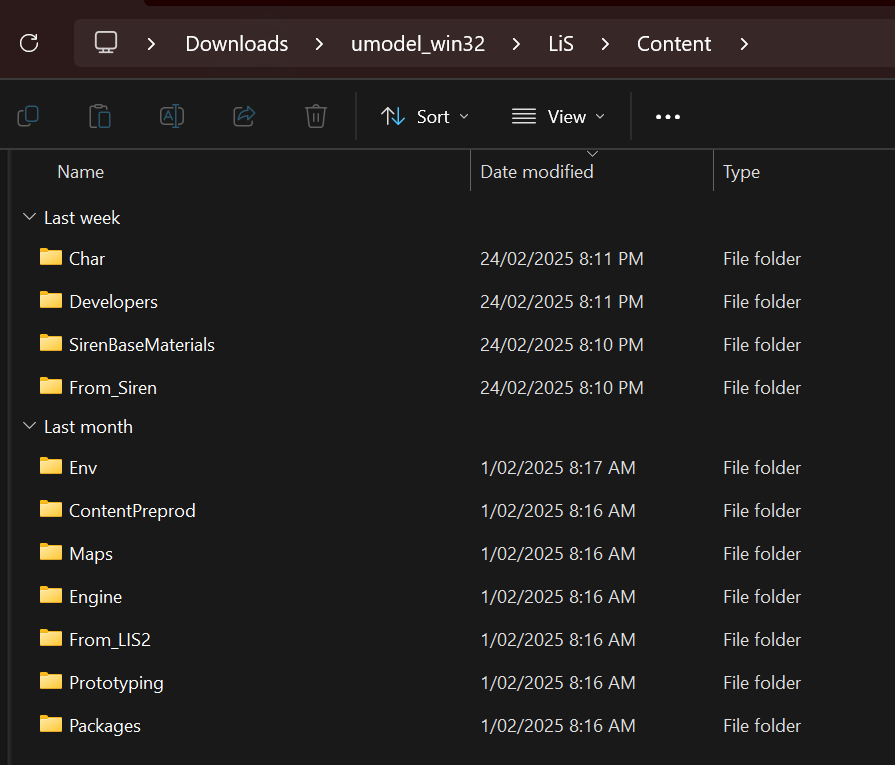

# README

These two scripts help with importing .umap files from *Life is Strange: Remastered*, and its materials into Blender.

This was only tested on Blender 4.3, so I'm unsure on whether it works on older versions, but feel free to try it out.

## Requirements

- A *Steam* copy of *Life is Strange: Remastered*.
- Blender (preferably 4.3)
- [FModel](https://fmodel.app/)
- [UModel](https://www.gildor.org/en/projects/umodel) 

## Usage

- Export the .umap file you wish to import into Blender using [FModel](https://fmodel.app/) as a .json file.
- Export the required assets from the game files using [UModel](https://www.gildor.org/en/projects/umodel) (it might be easier to export all the files from `Packages/Environment` and `Packages/Objects` rather than exporting them individually).
    - Make sure the static meshes are exported as .gltf files and the textures as .tga files.
- Clone this repository into a folder of your choice.
- In a Blender project, open the 'Scripting' workspace, and open the `map_mesh_import.py` file in its text editor.
- Replace the example directories with the directories where you have your .json file and your exported assets.
    - For the exported assets, the extracted asset folders must be contained as per the following file path: `BASE_DIR\LiS\Content\EXPORTED_ASSETS`
    
- Run `map_mesh_import.py`. Depending on how many assets the map has, it may take a while and Blender will be unresponsive while it imports all the meshes, so be patient.
- Once the models have been imported, open `map_material_cleanup.py` in the text editor, and replace the example material directory with the exported assets' base directory.
- Run `map_material_cleanup.py`. This may also take a while depending on how many textures there are to load.
- Congrats, you now have a fully imported map from the game.

## Credits

- [GanonMaster](https://github.com/Ganonmaster/Blender-Scripts/tree/master/ue4map-tools) for the original scripts that I heavily based this off of.
- bosterm93 for testing out the scripts.

